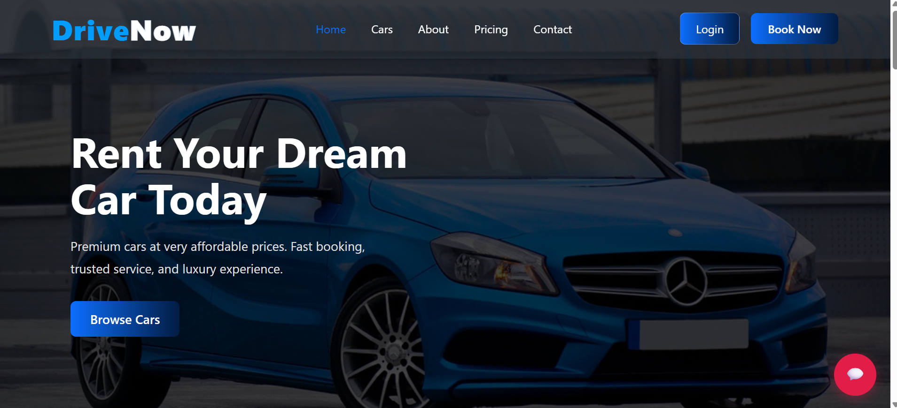
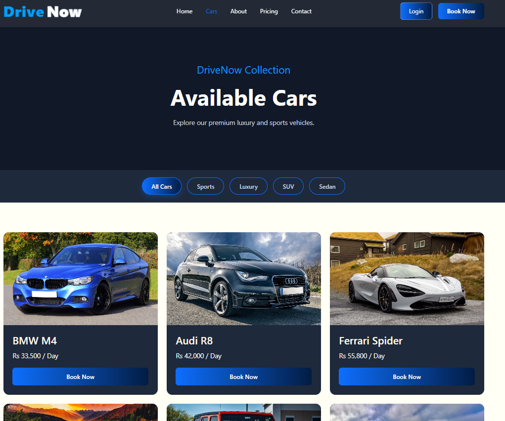
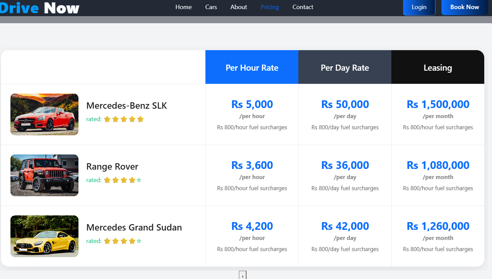
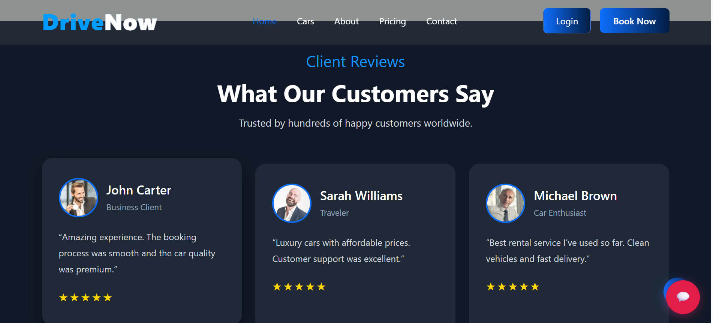
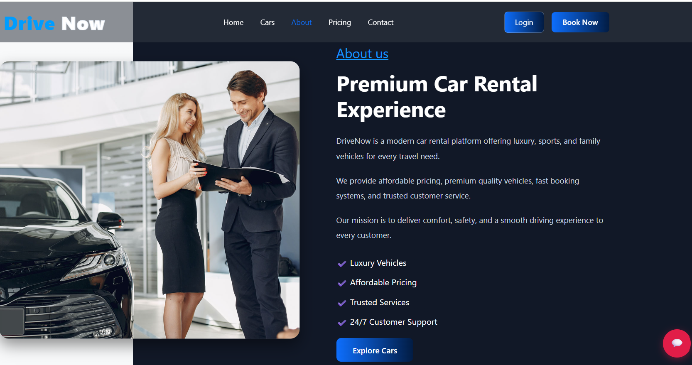
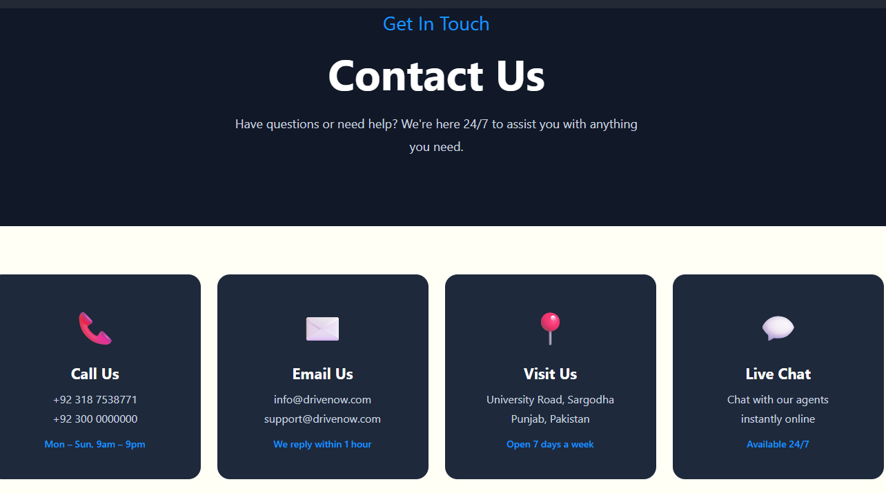

# DriveNow — Full-Stack Car Rental & Fleet Management System

> **A production-ready automotive rental and fleet booking web application built with Django, MySQL/SQLite, and modern JavaScript, featuring real-time vehicle cataloging, reservation workflows, customer account management, and an administrative fleet dashboard.**

[](https://www.python.org/)
[](https://www.djangoproject.com/)
[](https://www.mysql.com/)
[](LICENSE)

---

## 🚗 Overview

**DriveNow** is a full-stack car rental platform engineered to streamline the end-to-end vehicle hiring experience. From browsing luxury, economy, and SUV vehicle fleets to real-time price estimation, date selection, user authentication, and reservation tracking, DriveNow provides both a customer-facing portal and administrative controls for rental fleet operators.

---

## ✨ Features

- **Dynamic Fleet Catalog:** Browse and filter vehicles by category (Sedan, SUV, Luxury, Sports), transmission, fuel type, seating capacity, and daily pricing.
- **Reservation & Booking Engine:** Real-time date pickers calculate duration, daily rates, optional insurance additions, and estimated total costs.
- **User Authentication & Profiles:** Secure registration, login, session management, and personalized booking history dashboards.
- **Administrative Fleet Management:** Django Admin dashboard for adding new vehicles, updating availability status, managing customer bookings, and tracking vehicle maintenance.
- **Customer Reviews & Testimonials:** Integrated feedback system showcasing verified renter experiences.
- **Dual Database Flexibility:** Configurable for enterprise MySQL in production or seamless zero-config SQLite for local development and testing.

---

## 📸 Screenshots

| Landing & Fleet Showcase | Vehicle Catalog & Filters |
|:---:|:---:|
|  |  |
| *Hero banner with responsive booking inquiry* | *Fleet grid with specifications and pricing* |

| Pricing & Rental Packages | Customer Reviews & Trust |
|:---:|:---:|
|  |  |
| *Tiered daily, weekly, and monthly rates* | *Customer testimonials and rating distribution* |

| About Our Fleet | Direct Inquiry & Support |
|:---:|:---:|
|  |  |
| *Company mission and fleet standards* | *Customer support and booking inquiries* |

---

## 🛠️ Technology Stack

- **Backend:** Python 3.10+, Django 5.x
- **Database:** MySQL 8.0 (production) / SQLite3 (local development)
- **Frontend:** HTML5, CSS3 Custom Properties, JavaScript (Fetch API, DOM manipulation)
- **Authentication:** Django Built-in User Auth & Session Middleware
- **Architecture:** Django MVT (Model-View-Template) pattern with decoupled static assets

---

## 🚀 Getting Started

### 1. Clone the repository
```bash
git clone https://github.com/Haroon-World/DriveNow.git
cd DriveNow
```

### 2. Set up virtual environment
```bash
python -m venv venv
# On Windows:
venv\Scripts\activate
# On Linux/macOS:
source venv/bin/activate
```

### 3. Install dependencies
```bash
pip install -r requirements.txt
```

### 4. Configure environment variables
Create a `.env` file based on `.env.example`:
```bash
copy .env.example .env
```
For quick local testing with SQLite:
```ini
DN_SECRET_KEY=your_secure_dev_key
DN_DEBUG=1
DN_ALLOWED_HOSTS=localhost,127.0.0.1
DN_DB_ENGINE=sqlite
```
*(Or specify MySQL credentials if connecting to an external MySQL server).*

### 5. Run migrations & start server
```bash
python manage.py makemigrations
python manage.py migrate
python manage.py runserver
```
Visit [http://127.0.0.1:8000](http://127.0.0.1:8000) in your browser.

---

## 📂 Project Structure

```
DriveNow/
├── accounts/               # User authentication, profiles, registration
│   ├── models.py
│   ├── views.py
│   └── urls.py
├── core/                   # Fleet management, cars catalog, booking logic
│   ├── models.py           # Car and Booking relational models
│   ├── views.py            # Reservation and catalog views
│   └── urls.py
├── drivenow_project/       # Django project configuration (settings, URLs, WSGI)
│   ├── settings.py
│   └── urls.py
├── images/                 # Vehicle and banner static assets
├── docs/screenshots/       # UI showcase screenshots
├── .env.example            # Environment configuration template
├── manage.py               # Django management CLI
└── requirements.txt
```

---

## 💡 Lessons Learned

- **Database Abstraction:** Decoupling database configuration using environment variables allows developers to run tests on SQLite without spinning up a full MySQL daemon, while maintaining production readiness.
- **Relational Integrity for Fleet Availability:** Validating overlapping reservation date ranges at both the application level and database constraint level prevents costly double-booking errors.
- **Clean Static Asset Organization:** Structuring vehicle imagery and styles with caching headers improves client-side rendering speed for image-heavy automotive catalogs.

---

## 📄 License

Distributed under the MIT License. See [LICENSE](LICENSE) for more information.

---

## 👤 Author

**Muhammad Haroon Siddique**  
*Agentic AI & Python Software Engineer*  
*Top Position, Arfa Karim Fellowship Program 2026*  

- **LinkedIn:** [linkedin.com/in/muhammad-haroon-engr](https://www.linkedin.com/in/muhammad-haroon-engr)  
- **GitHub:** [@Haroon-World](https://github.com/Haroon-World)